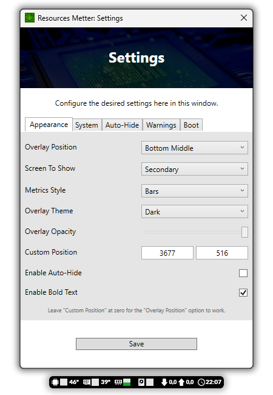

    
     
    Clone this repository and then copy the "Resources-Metter-Compiled" folder to your computer. Read all the instructions below and then just enjoy!

# To use this Software

First, download this repository by cloning the "Resources-Metter-Compiled" folder to your computer. After that, run the "Resources Metter.exe" file present in "Resources-Metter-Compiled/Resources Metter/program/bin". So just enjoy!

You can move the "Resources Metter" folder to somewhere you prefer on your computer and after placing the folder in the best location you decide, you can go to the software settings and then enable "Auto Start", so Resources Mettter will launch as soon as your computer turns on.

By right-clicking the "Resources Metter" status icon on your taskbar, you will be able to access various Software options, including settings, etc.

# Prerequisites to use this Software

You need to fulfill some requirements to be able to use this Software...

- The computer may need to have <a href="https://go.microsoft.com/fwlink/?LinkId=2085155" target="_blank">.Net Framework 4.8</a> installed in order to run the Software.
- The computer must be 64-bit.
- Your operating system's UAC needs to be disabled, or at the very least you need to allow Resources Metter to work without the UAC getting in your way.Your operating system's UAC needs to be disabled, or at the very least you need to allow Resources Metter to work without the UAC getting in your way. If the UAC blocks the Resources Metter for some reason, several metering functions will stop working. You can refer to <a href="https://www.howtogeek.com/howto/windows-vista/disable-user-account-control-uac-the-easy-way-on-windows-vista/" target="_blank">this</a> link for more details on Windows UAC.

# About this Software

This software was developed using Visual Studio and the C# language. It was created with the intention of being completely free to use and also anyone can modify it if they want. The idea is that this is a free, ad-free, simple and useful software, where it is possible to consult in real time information about the GPU, CPU, RAM, Storage etc, data such as temperature, percentage of use and other things.

The software is customizable to adapt to different environments, it is malleable to the point that you can place it wherever you want and disable and enable features. You can even put it on a secondary monitor and watch it while you play for example. It's useful to know how your Hardware consumption is, current time and other things!

This project uses the library "LibreHardwareMonitor" to obtain the temperature and uses of hardware informations. You can refer to <a href="https://github.com/LibreHardwareMonitor/LibreHardwareMonitor" target="_blank">this</a> link for more details about the library.

# How to edit this Software

The source project of this Software is here in this repository as well. You can simply open the "Resources-Metter-Source" folder with your Visual Studio IDE and edit the Software.

# Support projects like this

If you liked this Resources Metter and found it useful for your, please consider making a donation (if possible). This would make it even more possible for me to create and continue to maintain projects like this, but if you cannot make a donation, it is still a pleasure for you to use it! Thanks! 😀

 

    

 

Created with ❤ by Marcos Tomaz

